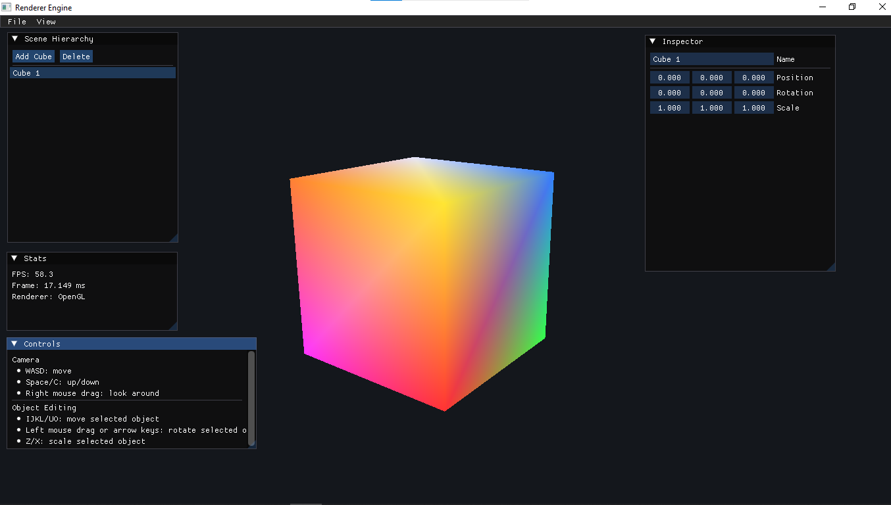

# Renderer Engine

This is a small C++ OpenGL engine/editor scaffold inside `Renderer_Opengl/Engine`.

## Screenshot



## Done

- CMake project setup
- GLFW window creation
- OpenGL context creation
- GLEW OpenGL function loading
- Application main loop
- OpenGL renderer
- Shader loading from files
- Shader compile/link error logging
- VAO, VBO, and EBO wrapper classes
- Perspective camera
- WASD camera movement
- Right mouse camera look
- Mesh class with cube geometry
- Transform system with position, rotation, and scale
- Scene system with editable cube objects
- Keyboard and mouse editor controls
- Dear ImGui integrated from `Renderer_Opengl/Libraries/imgui`
- GUI menu bar
- Scene Hierarchy panel
- Inspector panel
- Stats panel
- Controls panel

## GUI

The engine now has a basic Dear ImGui editor interface.

Current GUI panels:

- `File` menu
- `View` menu
- `Scene Hierarchy`
- `Inspector`
- `Stats`
- `Controls`

The `Scene Hierarchy` lets you select objects and add/delete cubes.

The `Inspector` lets you edit the selected cube name, position, rotation, and scale.

The `Stats` panel shows FPS and frame time.

## Camera Controls

- `W`: move camera forward
- `S`: move camera backward
- `A`: move camera left
- `D`: move camera right
- `Space`: move camera up
- `C`: move camera down
- Hold right mouse button and drag: look around

## Object Editor Controls

- `TAB`: select next cube
- `SHIFT + TAB`: select previous cube
- `N`: add cube
- `DELETE`: delete selected cube
- `I/J/K/L`: move selected cube on X/Y
- `U/O`: move selected cube forward/back in depth
- Hold left mouse button and drag: rotate selected cube
- Arrow keys: rotate selected cube
- `Z/X`: scale selected cube down/up
- `ESC`: close window

## Build

From this folder:

```powershell
cmake -S . -B build
cmake --build build
```

Run:

```powershell
.\build\Sandbox.exe
```

## Required Libraries

Already connected locally or through MSYS2:

- OpenGL
- GLFW
- GLEW
- Dear ImGui

Local library folder:

```text
Renderer_Opengl/Libraries/
  glew-2.3.1/
  glfw-3.4.bin.WIN64/
  imgui/
```

## Next Steps

- Add a proper viewport panel using a framebuffer
- Add texture loading with `stb_image`
- Add material system
- Add model loading with Assimp
- Add scene save/load
- Add transform gizmos
- Add console/log panel
- Add asset browser
- Add lighting controls


