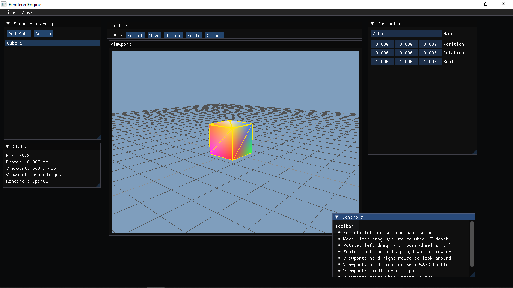
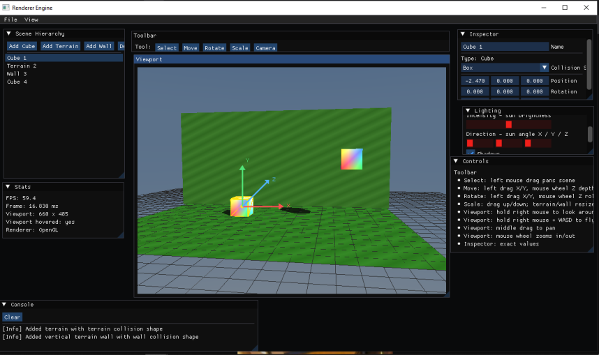
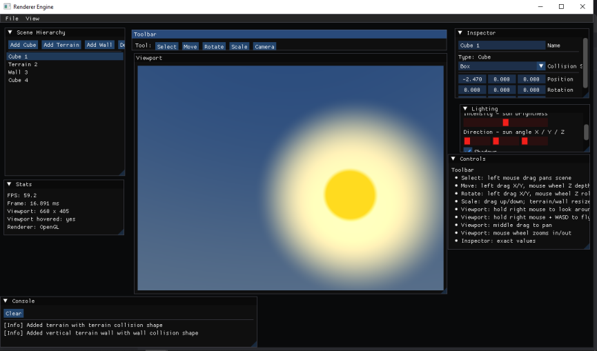

# Renderer Engine

A small C++ OpenGL renderer/editor scaffold with a Dear ImGui editor, viewport rendering, scene objects, terrain tools, lighting controls, and simple shadows.

## Screenshots








## What Is Added

- C++ OpenGL renderer/editor scaffold
- GLFW window and input handling
- GLEW OpenGL function loading
- Dear ImGui editor interface
- Framebuffer viewport rendered inside ImGui
- Scene Hierarchy panel
- Inspector panel
- Stats panel
- Controls panel
- Console/log panel
- Toolbar with Select, Move, Rotate, Scale, and Camera tools
- Editable cube objects
- Terrain objects
- Vertical terrain wall objects
- Collision shape type selection for objects
- Box, terrain, and wall collision shape names
- Selected-object yellow outline
- Move axis guide with X/Y/Z directions
- Rotate circular guide
- Scale guide and resize handles
- Mouse-based object selection
- Mouse-based object movement, rotation, and scale
- Unity-style viewport camera controls
- Sky-colored viewport background
- Directional sun-style sky lighting
- Ground grid
- Material color controls
- Scene save/load support
- Lighting controls for ambient light, intensity, and direction
- Shadow toggle
- Shadow strength control
- Simple projected shadows on terrain

## Editor Panels

The editor currently includes:

- `File` menu
- `View` menu
- `Toolbar`
- `Scene Hierarchy`
- `Viewport`
- `Inspector`
- `Stats`
- `Lighting`
- `Console`
- `Controls`

The `Scene Hierarchy` lets you add cubes, add terrain, add walls, delete objects, and select objects.

The `Inspector` lets you edit the selected object name, type-specific settings, collision shape, position, rotation, scale, and material color.

The `Viewport` renders the OpenGL scene into a framebuffer texture and displays it inside the editor UI.

## Viewport Controls

- Hold right mouse and move mouse: look around scene camera
- Hold right mouse + `W/A/S/D`: fly camera
- Hold right mouse + `Space/C`: move camera up/down
- Middle mouse drag: pan scene
- Mouse wheel: zoom camera

## Toolbar Tools

- `Select`: select objects and pan the scene
- `Move`: drag the X/Y/Z axis guide to move selected objects
- `Rotate`: drag to rotate selected objects
- `Scale`: drag to scale cubes or resize terrain/walls
- `Camera`: viewport camera navigation mode

## Terrain And Walls

- `Add Terrain` creates a flat editable terrain plane.
- `Add Wall` creates a vertical terrain wall.
- Terrain can be resized by width and depth.
- Walls can be resized by width and height.
- Walls support direction options so they can face across different scene axes.

## Lighting And Shadows

The lighting panel controls:

- Ambient light for shadow/base brightness
- Sun intensity for directional light strength
- Sun direction with X/Y/Z sliders
- Shadows on/off
- Shadow strength

Current shadows are simple projected planar shadows. They are useful for learning and editor feedback. A future full engine version can use shadow maps for proper real-time shadows from all geometry.

## Build

From this folder:

```powershell
cmake -S . -B build
cmake --build build
```

Run:

```powershell
.\build\Sandbox.exe
```

If PowerShell cannot find CMake, use the MSYS2 path first:

```powershell
$env:Path = 'C:\msys64\ucrt64\bin;C:\msys64\mingw64\bin;' + $env:Path
cmake --build build
.\build\Sandbox.exe
```

## Required Libraries

Already connected locally or through MSYS2:

- OpenGL
- GLFW
- GLEW
- Dear ImGui

Local library folder:

```text
Renderer_Opengl/Libraries/
  glew-2.3.1/
  glfw-3.4.bin.WIN64/
  imgui/
```

## Feature Status

- Done: editor viewport
- Done: scene hierarchy and inspector
- Done: cube objects
- Done: terrain and wall objects
- Done: transform tools
- Done: material color controls
- Done: scene save/load through `Scenes/default.scene`
- Done: console/log panel
- Done: lighting controls
- Done: sky background and directional sun lighting
- Done: simple projected terrain shadows
- Added groundwork: texture class and checkerboard texture support
- Blocked by dependency: full image texture loading needs `stb_image`
- Blocked by dependency: model loading needs Assimp, for example `pacman -S mingw-w64-ucrt-x86_64-assimp`
- Next: real 3D transform gizmo picking
- Next: real shadow mapping
